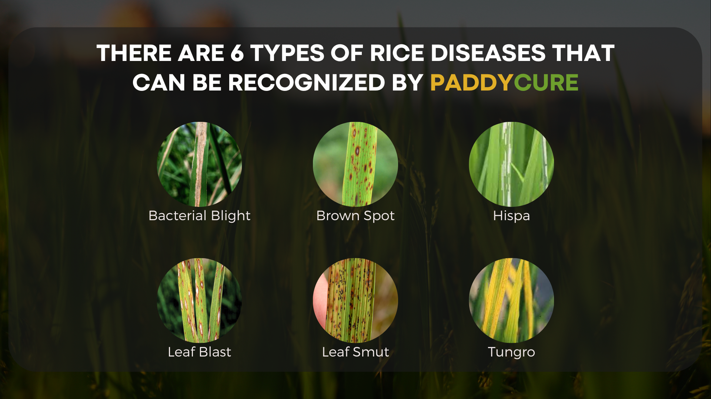
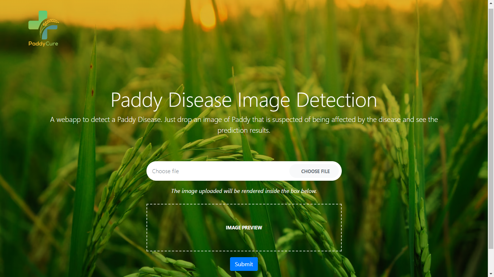

# PaddyCure - Machine Learning


## Leaf Rice Scan Disease
This project creates a machine learning model that can recognize six types of disease in rice plants and one healthy class only by taking photos of rice leaves that are suspected of being affected by the disease. The following six types of diseases:
- Bacterial Blight
- Brown Spot
- Hispa
- Leaf Blast
- Leaf Smut
- Tungro



By making this machine learning model, it is hoped that it can help farmers find out the diseases their rice suffers from and provide treatment according to their disease.

## Methods
This project uses the help of pre-trained [MobileNetV3](https://tfhub.dev/google/imagenet/mobilenet_v3_large_100_224/feature_vector/5) models to improve accuracy and add several DNN, Dropout, and Flatten layers.

## Installation & Usage
This is a simple deployment to use the web-based Rice Leaf Scan Disease model using localhost.
Make sure your device has `Python` installed properly, then download this repository to local storage, open your terminal according to the repository directory that was downloaded earlier, and then type the following code to install the required libraries:

```
pip install -r requirements. txt
```

If nothing happens, try this code:

```
python -m pip install -r requirements.txt
```

After finishing installing the required libraries, type the following code to run the website:

```
python app.py
```

After that, a localhost address will appear to access the rice leaf disease scan website. Copy and paste it in your web browser:

```
http://127.0.0.1:9000/
```

After that, the web browser will display a menu that can be used to predict disease in rice leaves.



### Usage Suggestion
To get good accuracy, it's best to take photos of diseased rice with a clean background, or take off the diseased rice leaves first and then take the photo.

## Datasets
This project uses open-source datasets. Here are the links:
- https://www.kaggle.com/datasets/shayanriyaz/riceleafs
- https://www.kaggle.com/datasets/vbookshelf/rice-leaf-diseases
- https://data.mendeley.com/datasets/znsxdctwtt/1
- https://data.mendeley.com/datasets/fwcj7stb8r
